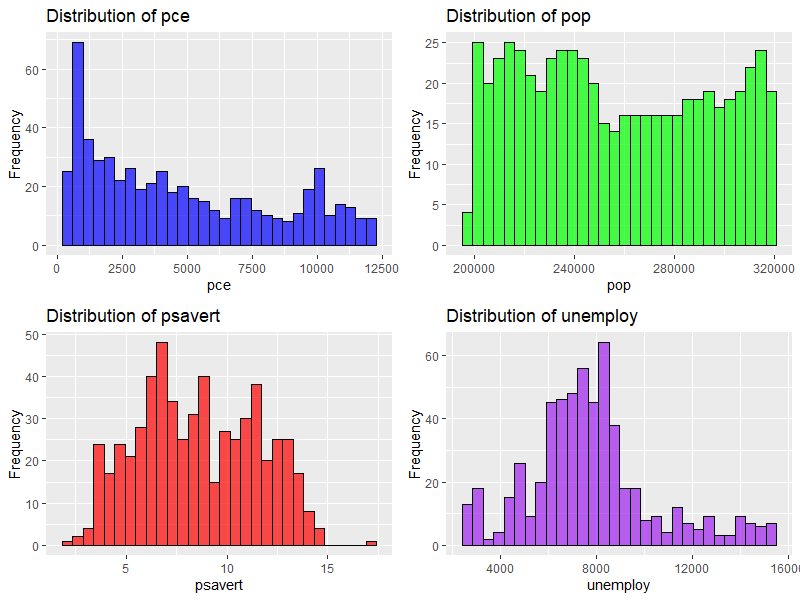
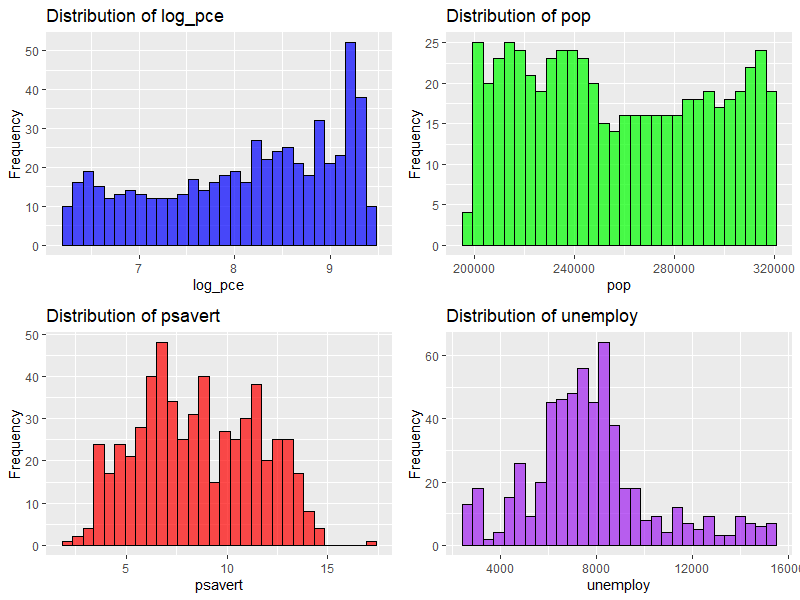
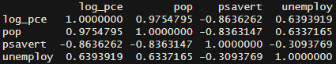
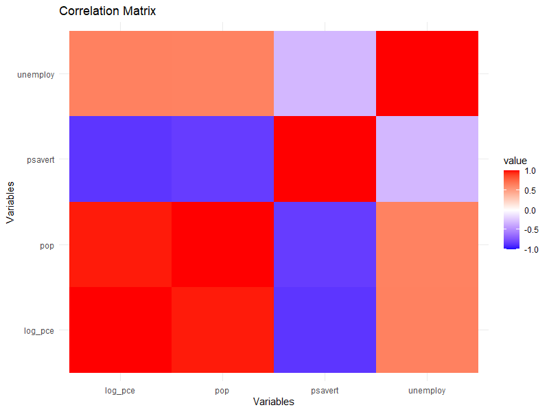
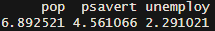
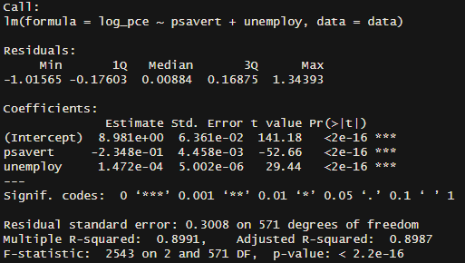
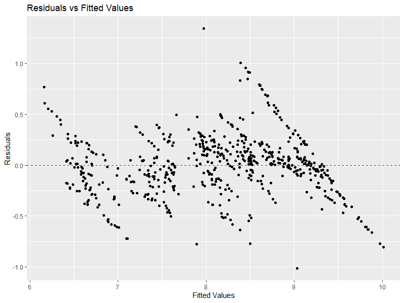
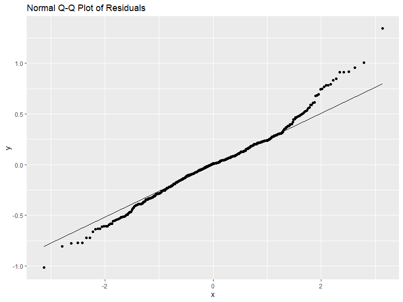
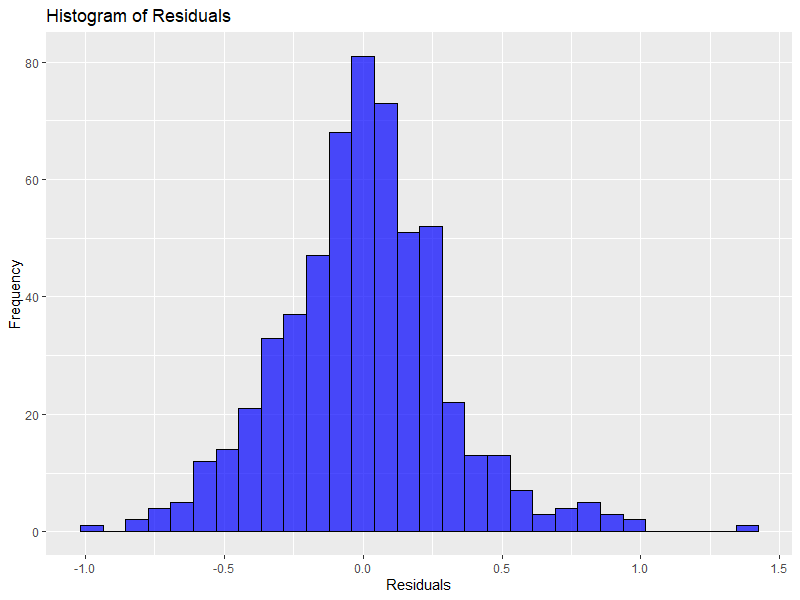

# Linear Regression and Residual Analysis

## Overview
This repository provides a guide to running linear regression in R, focusing on practical implementation, interpretation, and diagnostics. It covers data inspection, distribution analysis, transformations, correlation analysis, model building, and residual diagnostics.

## Getting Started

### Prerequisites
- **R** (version 4.0 or higher)
- Required libraries: `ggplot2`, `gridExtra`, `dplyr`, `car`, `reshape2`

### Installation
Install the required R packages:
   ```R
   install.packages(c("ggplot2", "gridExtra", "dplyr", "car", "reshape2"))
   ```

## Contents

### Data Inspection

**Code:**
```R
# Load the built-in economics dataset
library(ggplot2)
data <- economics

# Inspect the dataset
summary(data)
str(data)
```

**Interpretation:**
- The `economics` dataset provides variables such as `pce` (personal consumption expenditures), `pop` (population), `psavert` (personal savings rate), and `unemploy` (unemployment).
- Use `summary()` and `str()` to understand variable distributions and data structure.

---

### Data Distribution

**Code:**
```R
library(gridExtra)

dist_pce <- ggplot(data, aes(x = pce)) +
  geom_histogram(bins = 30, fill = "blue", alpha = 0.7, color = "black") +
  labs(title = "Distribution of pce", x = "pce", y = "Frequency")

dist_pop <- ggplot(data, aes(x = pop)) +
  geom_histogram(bins = 30, fill = "green", alpha = 0.7, color = "black") +
  labs(title = "Distribution of pop", x = "pop", y = "Frequency")

grid.arrange(dist_pce, dist_pop, ncol = 2)
```


**Interpretation:**
- The histogram reveals that `pce` is positively skewed, suggesting the need for a logarithmic transformation.
- Other variables, such as `pop`, appear more symmetrically distributed.

---

### Log Transformation

**Code:**
```R
library(dplyr)
data <- data %>%
  mutate(log_pce = log(pce))
```


**Interpretation:**
- Applying a logarithmic transformation to `pce` normalizes its distribution, making it suitable for regression.

---

### Correlation Analysis

**Code:**
```R
library(reshape2)
cor_matrix <- cor(data %>% select(log_pce, pop, psavert, unemploy), use = "complete.obs")
cor_melt <- melt(cor_matrix)

ggplot(cor_melt, aes(Var1, Var2, fill = value)) +
  geom_tile() +
  scale_fill_gradient2(low = "blue", high = "red", mid = "white", midpoint = 0) +
  theme_minimal() +
  labs(title = "Correlation Matrix")
```




**Interpretation:**
- High correlations (e.g., `log_pce` and `pop`: 0.975) indicate potential multicollinearity concerns.
- Correlations help identify relationships between variables.

---

### Variance Inflation Factor (VIF) Analysis

**Code:**
```R
library(car)
model_vif <- lm(log_pce ~ pop + psavert + unemploy, data = data)
vif_values <- vif(model_vif)
print(vif_values)
```


**Interpretation:**
- A VIF above 5 suggests moderate multicollinearity, while values above 10 indicate severe multicollinearity.
- Address multicollinearity by removing or transforming variables.

---

### Regression Model

**Code:**
```R
model <- lm(log_pce ~ psavert + unemploy, data = data)
summary(model)
```


**Interpretation:**
- Significant predictors (`psavert` and `unemploy`) help explain the variance in `log_pce`.
- Adjusted R-squared (~0.899) suggests a strong model fit.

---

### Residual Analysis

**Code:**
```R
residuals <- resid(model)

ggplot(data, aes(x = fitted(model), y = residuals)) +
  geom_point() +
  geom_hline(yintercept = 0, color = "red", linetype = "dashed") +
  labs(title = "Residuals vs Fitted Values")
```




**Interpretation:**
- Residual diagnostics indicate assumptions of linearity and homoscedasticity are reasonably met.
- Minor deviations in residual plots are acceptable within practical limits.

---

### Practical Implications

1. **Policy Recommendations:**
   - Lower savings rates might boost consumption.
   - Consider addressing multicollinearity for better model interpretability.

2. **Model Limitations:**
   - Include additional predictors (e.g., income, inflation) to enhance model accuracy.

3. **Future Steps:**
   - Validate the model with out-of-sample data.
   - Explore interaction terms or non-linear relationships.
